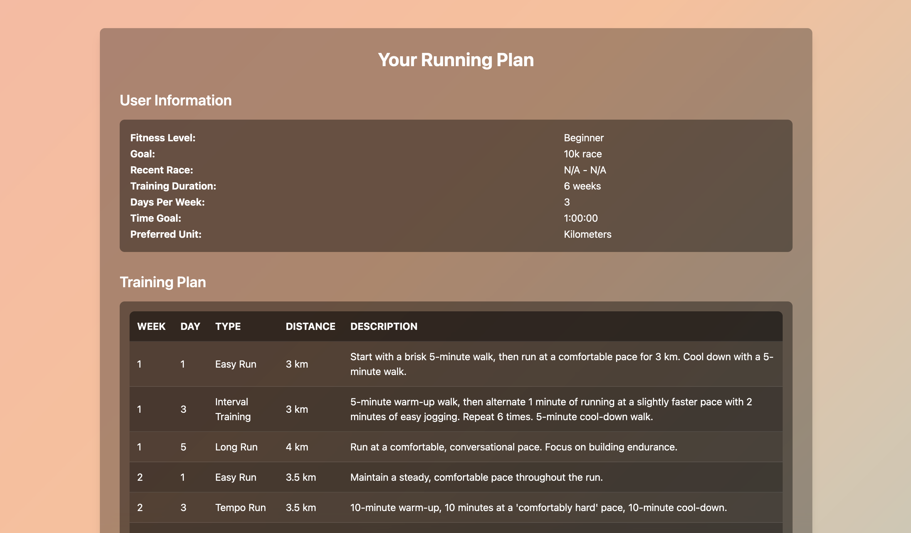

## Running Training Plan Generator

A web app which provides most of the functionality that the Runna app gives users but for free as opposed to $20 per month. The user inputs are fed into the Claude 3.5 Sonnet API which creates a training plan which can then be saved by the user. The response from Claude are formatted as JSON to help with the consistent formatting of the results for the user. 

The API calls cost around $0.03 each at the moment, but the results are cached so the same request will return the same results and not call the API. The initial attempt to run this using OpenAI's API wasn't great due to inconsistent responses, but Claude 3.5 appears to be performing significantly better for the task.

The users initally inputs their details as shown in the first image below, and then receives a training plan which includes some additional information that the user may find useful. 

